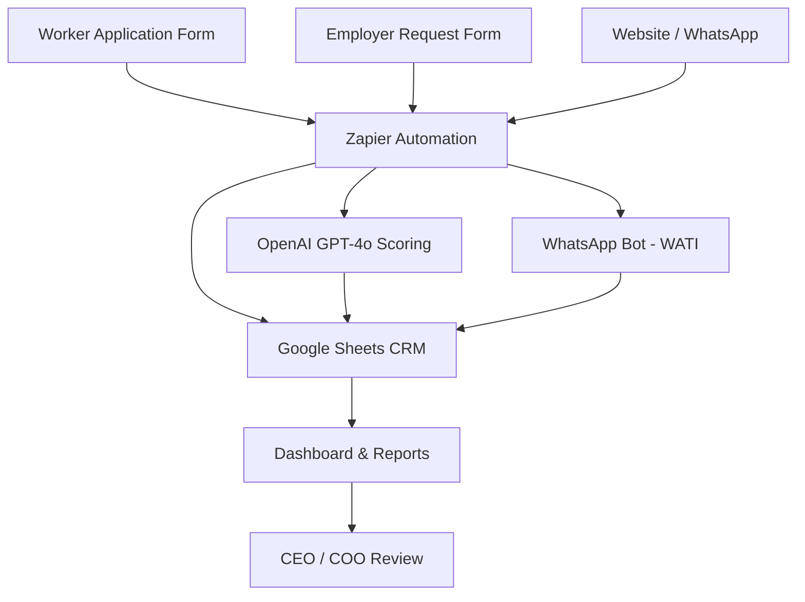

<div align="center">

# 🌍 Kingken Global Recruitment Platform

**Connecting Verified African Talent with Top International Employers**

[](https://www.kingkenglobal.com.ng)
[](CHANGELOG.md)
[](LICENSE)
[](docs/SETUP_GUIDE.md)

**Website:** [https://www.kingkenglobal.com.ng](https://www.kingkenglobal.com.ng) | **Email:** [info@kingkenglobal.com.ng](mailto:info@kingkenglobal.com.ng) | **WhatsApp:** [+96569048174](https://wa.me/96569048174)

</div>

---

## 📋 Table of Contents

- [Overview](#overview)
- [Mission & Vision](#mission--vision)
- [Platform Architecture](#platform-architecture)
- [Core Systems](#core-systems)
- [Platform Status](#platform-status)
- [Quick Start](#quick-start)
- [Tech Stack](#tech-stack)
- [Documentation](#documentation)
- [Roadmap](#roadmap)
- [Contributing](#contributing)
- [Company Info](#company-info)

---

## 🌐 Overview

**Kingken Global Travel Agency Ltd** operates an international recruitment SaaS platform that connects skilled and semi-skilled African workers with verified employers in Kuwait, UAE, Qatar, and globally. The platform handles the full lifecycle from candidate intake and AI-powered screening to employer matching, deal tracking, and deployment management.

> **Our mission:** To create a transparent, scalable, and technology-driven international recruitment ecosystem that empowers African workers and delivers verified talent to global employers.

### Target Markets

| Region | Countries |
|--------|-----------|
| **Gulf / Middle East** | Kuwait, UAE, Qatar, Saudi Arabia, Bahrain, Oman |
| **Africa — Source Countries** | Nigeria, Ghana, Kenya, Ethiopia, Uganda, Tanzania, Cameroon, Senegal |

---

## 🎯 Mission & Vision

**Mission:** To be the most trusted and technologically advanced international recruitment platform connecting Africa's workforce with verified global employers.

**Vision:** To deploy 10,000+ African workers globally by 2026, establishing Kingken Global as the leading pan-African international workforce mobility company.

**Values:** Transparency · Integrity · Innovation · Speed · Compliance

---

## 🏗️ Platform Architecture

```
┌─────────────────────────────────────────────────────────────────┐
│                    KINGKEN GLOBAL PLATFORM                       │
├─────────────────────────────────────────────────────────────────┤
│                                                                   │
│  [WORKER FORM]     [EMPLOYER FORM]     [WEBSITE / APP]          │
│       │                  │                    │                  │
│       └──────────────────┴────────────────────┘                  │
│                           │                                       │
│                    [ZAPIER AUTOMATION]                            │
│                           │                                       │
│       ┌───────────────────┼───────────────────┐                  │
│       ↓                   ↓                   ↓                  │
│  [GOOGLE SHEETS]    [OPENAI GPT-4o]    [WHATSAPP API]           │
│  (CRM + ATS)        (AI Scoring)       (WATI Bot)               │
│       │                   │                   │                  │
│       └───────────────────┴───────────────────┘                  │
│                           │                                       │
│                    [DASHBOARD + REPORTS]                          │
│                                                                   │
└─────────────────────────────────────────────────────────────────┘
```

**Mermaid Diagram:**



---

## 🔧 Core Systems

| System | Tool | Purpose |
|--------|------|---------|
| **Applicant Tracking (ATS)** | Google Sheets — Master Data | Store, track, and manage all candidate profiles |
| **CRM** | Google Sheets — Employers, Pipeline, Deals | Manage employers, deals, and revenue |
| **AI Screening Engine** | OpenAI GPT-4o via Zapier | Score candidates, generate summaries, match jobs |
| **Automation** | Zapier (6 Zaps) | Connect forms → sheets → AI → notifications |
| **WhatsApp Bot** | WATI / 360dialog | 24/7 employer and worker intake + FAQ |
| **Website** | Wix / Webflow / WordPress | Public-facing landing page with embedded forms |
| **Dashboard** | Google Sheets — Dashboard tab | Live KPIs: candidates, deals, revenue, pipeline |
| **Notifications** | Email + WhatsApp | Auto-reply, team alerts, COO notifications |

---

## 📊 Platform Status

| Component | Status | Notes |
|-----------|--------|-------|
| Google Forms (Worker) | ✅ Ready | 7 required fields |
| Google Forms (Employer) | ✅ Ready | 6 required fields |
| Google Sheets CRM | ✅ Ready | 7 tabs configured |
| Zapier Automations | ✅ Ready | 6 zaps operational |
| AI Scoring (OpenAI) | ✅ Ready | GPT-4o scoring |
| WhatsApp Bot (WATI) | ✅ Ready | Employer + Worker flows |
| Dashboard | ✅ Ready | All KPI formulas active |
| Website | 🔄 In Progress | Wix/Webflow build |
| Mobile App | 📋 Planned | Phase 2 (React Native) |

**Current Phase:** MVP v1.0.0

---

## 🚀 Quick Start

### Prerequisites

- Google Account (Workspace recommended)
- [Zapier](https://zapier.com) account (Professional plan)
- [OpenAI API key](https://platform.openai.com)
- [WATI](https://www.wati.io) or [360dialog](https://www.360dialog.com) WhatsApp Business account
- WhatsApp Business number verified

### Setup Steps

1. **Clone or fork this repository**
   ```bash
   git clone https://github.com/eze-kenneth-ogbonna/kingken-global-recruitment-platform.git
   cd kingken-global-recruitment-platform
   ```

2. **Copy environment variables**
   ```bash
   cp .env.example .env
   # Edit .env with your actual API keys and credentials
   ```

3. **Set up Google Sheets CRM**  
   Follow → [docs/SETUP_GUIDE.md](docs/SETUP_GUIDE.md)

4. **Deploy Google Apps Scripts**  
   Follow → [scripts/google-apps-script/README.md](scripts/google-apps-script/README.md)

5. **Configure Zapier Automations**  
   Follow → [docs/AUTOMATION_GUIDE.md](docs/AUTOMATION_GUIDE.md)

6. **Set up WhatsApp Bot**  
   Follow → [docs/WHATSAPP_BOT_GUIDE.md](docs/WHATSAPP_BOT_GUIDE.md)

7. **Go live**  
   Follow → [ops/ROLLOUT_CHECKLIST.md](ops/ROLLOUT_CHECKLIST.md)

---

## 🛠️ Tech Stack

### Phase 1 — MVP (Current)

| Layer | Tool | Purpose |
|-------|------|---------|
| Data Collection | Google Forms | Worker & employer intake forms |
| Database / CRM | Google Sheets | Master data, pipeline, deals |
| Automation | Zapier | End-to-end workflow automation |
| AI Engine | OpenAI GPT-4o | Candidate scoring & matching |
| Communication | WATI (WhatsApp API) | Bot, notifications, alerts |
| Website | Wix / Webflow | Public-facing platform |
| No-code App | Glide / Softr | Mobile app for workers/employers |
| Scripts | Google Apps Script | Sheet automation & data migration |

### Phase 2 — Full Platform (Planned)

| Layer | Tool |
|-------|------|
| Frontend | React.js / Next.js |
| Backend | Node.js + Express |
| Database | PostgreSQL |
| Cloud | AWS / GCP |
| Auth | Auth0 / Supabase |
| AI | OpenAI API + custom model |
| Payments | Stripe / Flutterwave |

### Phase 3 — Global Scale (Future)

- React Native mobile apps (iOS + Android)
- Microservices architecture
- ML-powered candidate matching
- Global CDN (Cloudflare)
- Multi-currency payment gateway
- 15+ country compliance modules

---

## 📚 Documentation

### Setup & Operations
| Document | Description |
|----------|-------------|
| [docs/SETUP_GUIDE.md](docs/SETUP_GUIDE.md) | Complete step-by-step platform setup |
| [DEVELOPMENT.md](DEVELOPMENT.md) | Developer environment setup |
| [ops/ROLLOUT_CHECKLIST.md](ops/ROLLOUT_CHECKLIST.md) | Go-live checklist |
| [ops/TESTING_GUIDE.md](ops/TESTING_GUIDE.md) | How to test all components |

### Platform Systems
| Document | Description |
|----------|-------------|
| [docs/GOOGLE_SHEETS_STRUCTURE.md](docs/GOOGLE_SHEETS_STRUCTURE.md) | All sheets, columns, formulas |
| [docs/AUTOMATION_GUIDE.md](docs/AUTOMATION_GUIDE.md) | All 6 Zapier automations |
| [docs/AI_SYSTEM_GUIDE.md](docs/AI_SYSTEM_GUIDE.md) | AI scoring & matching system |
| [docs/CRM_GUIDE.md](docs/CRM_GUIDE.md) | CRM system architecture |
| [docs/WHATSAPP_BOT_GUIDE.md](docs/WHATSAPP_BOT_GUIDE.md) | WhatsApp bot setup & scripts |
| [docs/WEBSITE_GUIDE.md](docs/WEBSITE_GUIDE.md) | Website build guide |
| [docs/API_REFERENCE.md](docs/API_REFERENCE.md) | Future API endpoints |

### Business & Strategy
| Document | Description |
|----------|-------------|
| [docs/SALES_FUNNEL_GUIDE.md](docs/SALES_FUNNEL_GUIDE.md) | Sales funnel & paid ads strategy |
| [docs/MVP_LAUNCH_PLAN.md](docs/MVP_LAUNCH_PLAN.md) | 14-day MVP launch roadmap |
| [docs/ROLES_AND_STRUCTURE.md](docs/ROLES_AND_STRUCTURE.md) | Org chart & role definitions |
| [docs/DAILY_REPORTING_SYSTEM.md](docs/DAILY_REPORTING_SYSTEM.md) | Daily report templates |

### Architecture
| Document | Description |
|----------|-------------|
| [ARCHITECTURE.md](ARCHITECTURE.md) | Full system architecture |
| [infrastructure/TECH_STACK.md](infrastructure/TECH_STACK.md) | Tech stack per phase |
| [infrastructure/SAAS_ARCHITECTURE.md](infrastructure/SAAS_ARCHITECTURE.md) | SaaS cloud architecture |
| [infrastructure/SECURITY_CONTROLS.md](infrastructure/SECURITY_CONTROLS.md) | Security policy & controls |

---

## 🗺️ Roadmap

### ✅ Phase 1 — MVP (Current — Q1 2026)
- [x] Google Forms (Worker + Employer)
- [x] Google Sheets CRM (7 tabs)
- [x] Zapier automations (6 zaps)
- [x] AI candidate scoring (OpenAI GPT-4o)
- [x] WhatsApp bot (WATI)
- [x] Dashboard with live KPIs
- [x] Daily reporting system
- [ ] Website live (Wix/Webflow)
- [ ] First 50 candidates screened
- [ ] First 3 employer deals closed

### 🔄 Phase 2 — Real Platform (Q3 2026)
- [ ] React.js frontend
- [ ] Node.js + PostgreSQL backend
- [ ] Auth0 authentication
- [ ] Employer portal (post jobs, review matches)
- [ ] Worker portal (apply, track status, upload docs)
- [ ] Admin panel (full CRM)
- [ ] Stripe/Flutterwave payment integration
- [ ] Automated contract generation
- [ ] Document verification system

### 🌍 Phase 3 — Global Scale (2027)
- [ ] iOS + Android mobile apps
- [ ] ML candidate matching engine
- [ ] Multi-country compliance (GDPR, NDPR, Kuwait labor law)
- [ ] Employer subscription model
- [ ] Partner agency network (15+ countries)
- [ ] 10,000+ worker deployments

---

## 🤝 Contributing

We welcome contributions from team members and trusted partners. Please read [CONTRIBUTING.md](CONTRIBUTING.md) before submitting pull requests.

Branch naming: `feature/`, `fix/`, `docs/`, `ops/`

---

## 🏢 Company Info

| Field | Details |
|-------|---------|
| **Company** | Kingken Global Travel Agency Ltd |
| **Website** | [https://www.kingkenglobal.com.ng](https://www.kingkenglobal.com.ng) |
| **Email** | [info@kingkenglobal.com.ng](mailto:info@kingkenglobal.com.ng) |
| **WhatsApp** | [+96569048174](https://wa.me/96569048174) |
| **Markets** | Kuwait, UAE, Qatar, Africa |
| **Type** | International Recruitment SaaS |
| **Phase** | MVP v1.0.0 |

---

## 📄 License

This project is licensed under the MIT License — see the [LICENSE](LICENSE) file for details.

© 2026 Kingken Global Travel Agency Ltd. All rights reserved.

---

## 🌍 Overview

The **Kingken Global Recruitment Platform** is an enterprise-level recruitment technology system developed by **Kingken Global Travel Agency Ltd**.

The platform is designed to connect skilled workers from Africa with verified employers across international labor markets, including:

• Kuwait  
• Middle East  
• Europe  
• Global job markets  

Our mission is to create a transparent, scalable, and technology-driven international recruitment ecosystem.

---

## 🚀 Platform Vision

To build one of the most advanced global recruitment infrastructures that enables:

Safe international employment  
Verified employer networks  
Digital worker identity systems  
AI-powered job matching  
Scalable recruitment automation  

---

## 🧠 Core Platform Systems

The Kingken Global ecosystem includes:

Global Recruitment Platform  
Worker Digital Identity System  
Employer Verification Network  
International Job Marketplace  
AI Recruitment Matching Engine  
Global Workforce Database  
Recruitment Automation System  

---

## 🏗 System Architecture

kingken-global-recruitment-platform
│
├── backend
├── frontend
├── api
├── database
├── integrations
├── automation
├── security
├── infrastructure
├── analytics
└── docs

---

